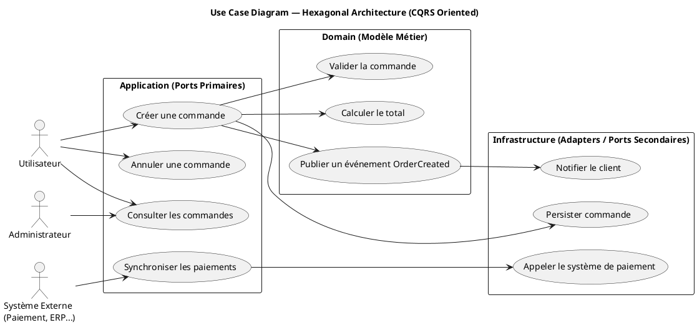
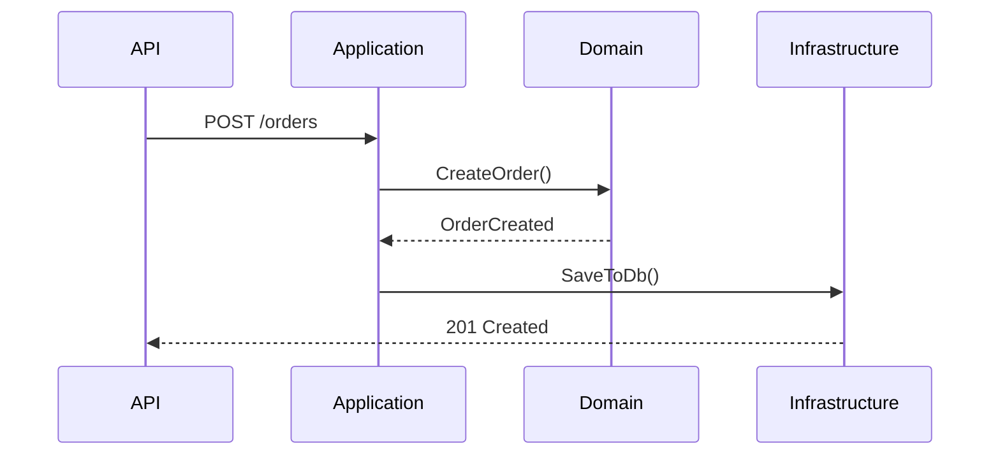
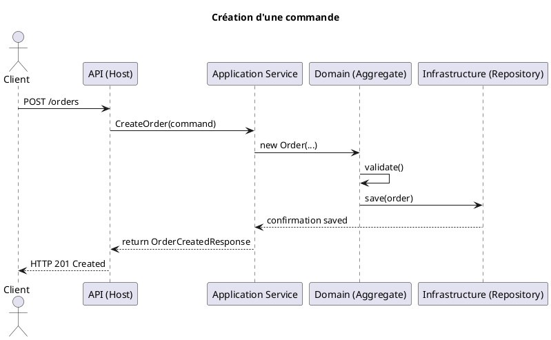

# Prerequisites

VSCode with extension: Markdown Preview Enhanced.

Markdown-preview-enhanced: Plantuml Server
Render using PlantUML server instead of binary. Leave it empty to use the builtin plantuml.jar binary (`java` is required in system path). Eg: "http://localhost:8080/svg/": https://kroki.io/plantuml/svg/

# Use cases

# Sequence diagram

